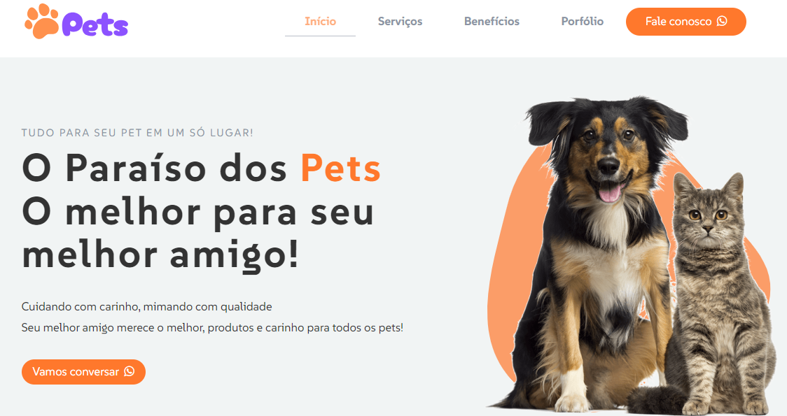
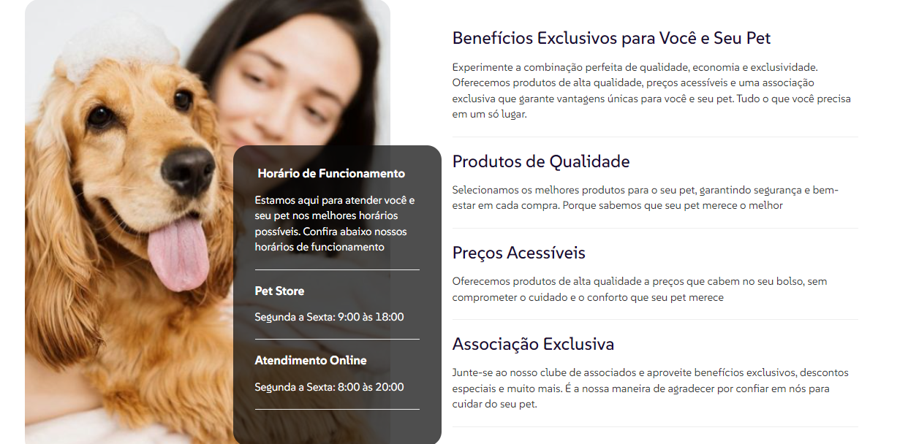

# Pets - Serviços para Animais de Estimação

Este é um projeto de um site fictício chamado **Pets**, criado para oferecer diversos serviços para animais de estimação. O site foi desenvolvido com o objetivo de praticar minhas habilidades em desenvolvimento web e fazer parte do meu portfólio.

## 🐾 Serviços Oferecidos

O site **Pets** foi pensado para oferecer uma experiência completa para donos de pets. Os serviços incluem:

- **Hospedagem para Pets**: Oferecemos um lar temporário com muito carinho e conforto para seu pet.
- **Cuidado Veterinário**: Nossos veterinários estão prontos para cuidar da saúde do seu animal de estimação.
- **Brinquedos para Pets**: Produtos de alta qualidade para garantir a diversão do seu pet.
- **Banho e Tosa**: Mantemos seu pet limpo e estiloso com os melhores cuidados.
- **Taxi Pet**: Transporte seguro e confortável para o seu pet, sempre que precisar.

## 🚀 Tecnologias Utilizadas

O site foi desenvolvido utilizando as seguintes tecnologias:

- **HTML5**: Estruturação do conteúdo da página.
- **CSS3**: Estilização do layout e componentes.
- **Bootstrap**: Framework CSS para design responsivo e componentes pré-construídos.
- **jQuery**: Para facilitar a manipulação de elementos da DOM e adicionar interatividade.

## 💡 Inspirações

As inspirações de design e funcionalidades deste site foram retiradas de temas disponíveis no **Theme Forest**.

## 🎯 Objetivo

O principal objetivo deste projeto foi praticar e aprimorar minhas habilidades em **desenvolvimento front-end**, focando em tecnologias amplamente usadas no mercado. Além disso, o projeto serve como uma peça do meu portfólio profissional.

## 📸 Screenshots

